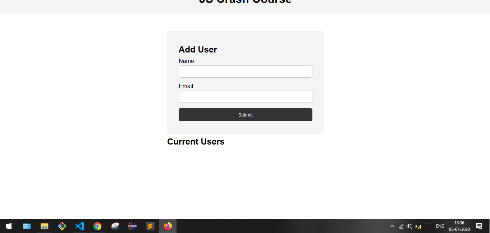

# javaScript-crash-course
<h1>Crash Course On Js</h1>

<ul>
    <li>Clone the repo</li>
    <li>open the index js on your code editor</li>
    <li> read throught the main.js filein js folder</li>
    <li>For any issues contact nsrivastava645@gmail.com</li>
</ul>

<<<<<<< HEAD

=======

>>>>>>> dd817d5d6fafe64dc7db9f3fe0f681e5f2632bde
